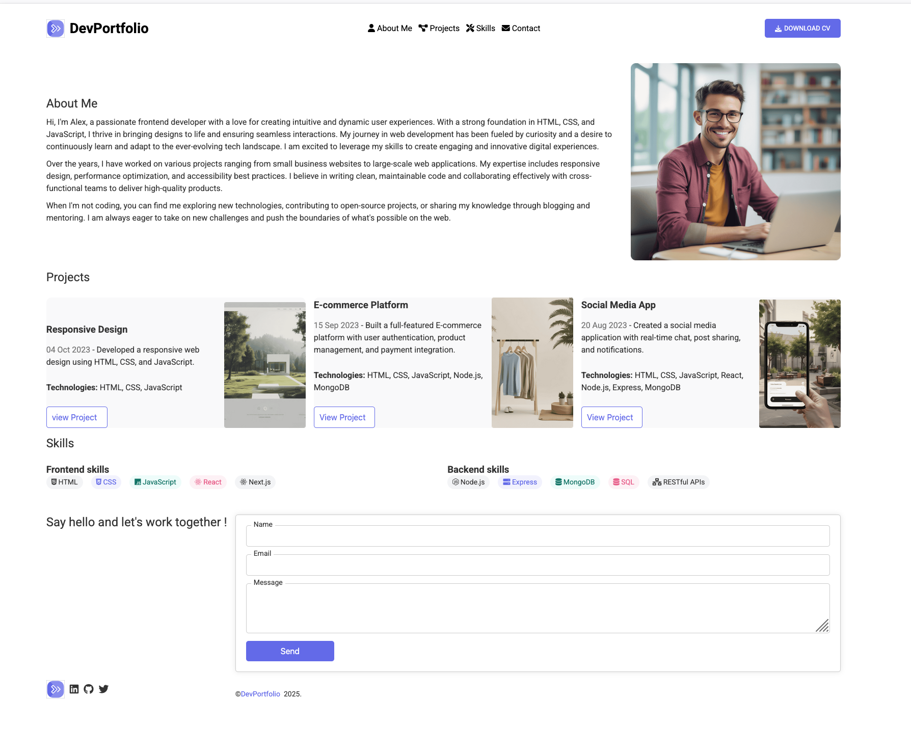

# DevPortfolio

[](LICENSE)

A modern, responsive portfolio website built with HTML, CSS, and JavaScript. Showcase your projects, skills, and contact information in a clean and professional layout.

---

## Table of Contents

- [Features](#features)
- [Screenshots](#screenshots)
- [Getting Started](#getting-started)
- [Usage](#usage)
- [Contributing](#contributing)
- [License](#license)
- [Contact](#contact)

---

## Features

- Responsive design for all devices
- Project showcase with images and descriptions
- Skills section for frontend and backend technologies
- Downloadable CV button
- Contact form with confirmation message
- Social media links
- Clean, modern UI

---

## Screenshots



---

## Getting Started

### Prerequisites

- Modern web browser (Chrome, Firefox, Edge, Safari)
- No additional dependencies required

### Installation

Clone the repository:

```bash
git clone https://github.com/bakadja/portfolio-codecademy.git
cd portfolio-codecademy
```

### Running Locally

Open `index.html` in your browser:

```bash
open index.html
```
Or simply double-click the file in your file explorer.

---

## Usage

- Update your profile information in `index.html`.
- Replace project images and descriptions as needed.
- Add your resume as `resume.pdf` for the download button.
- Customize skills and social media links.

---

## Contributing

Contributions are welcome! Please open issues or submit pull requests for improvements.

1. Fork the repository
2. Create your feature branch (`git checkout -b feature/YourFeature`)
3. Commit your changes (`git commit -am 'Add new feature'`)
4. Push to the branch (`git push origin feature/YourFeature`)
5. Open a pull request

---

## License

This project is licensed under the MIT License. See the [LICENSE](LICENSE) file for details.

---

